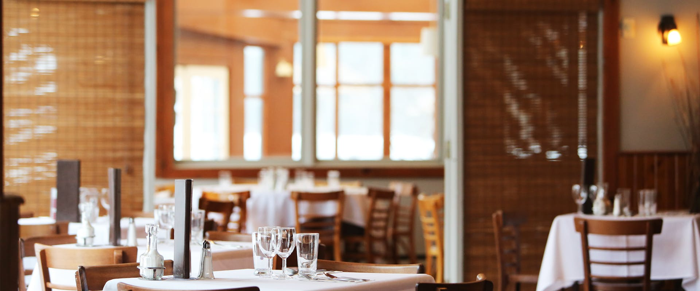

# Restaurant Website Business - Images Library

This organized image library supports the automated restaurant website development business with three distinct image collections for different purposes.

## 📁 Folder Structure Overview

### `/general/` - NEWLY ORGANIZED Image Library (82 images)
**Purpose**: Reorganized into 7 logical categories for easier browsing and faster template development.

**NEW CATEGORIES**:
- **`food/` (29 images)** - All food items: main dishes, appetizers, desserts, salads, international cuisine
  - Includes: pasta dishes, steaks, seafood, tacos, burgers, wings, chocolate cake, macarons, etc.
- **`drinks/` (12 images)** - All beverages: cocktails, wine, coffee, beer, juice, tea
  - Includes: mojito, martini, wine glasses, espresso, craft beer, etc.
- **`restaurant-spaces/` (6 images)** - Restaurant interiors, dining areas, kitchens, hero images
  - Includes: dining rooms, kitchen spaces, restaurant interiors for hero sections
- **`branding/` (10 images)** - Logos, icons, badges, restaurant identity elements
  - Includes: chef hat icons, fork/knife symbols, wine glass icons, premium badges
- **`business/` (8 images)** - Professional business settings, meetings, team collaboration
  - Includes: business meetings, handshakes, professional presentations
- **`people/` (1 image)** - Staff photos, chef portraits, team photography
  - Includes: professional chef portrait
- **`misc/` (16 images)** - Atmospheric photos, themes, events, specialty concepts
  - Includes: beach cafe themes, unique restaurant concepts, environmental photos

**Benefits**: Logical organization eliminates guesswork - food images in food/, drinks in drinks/, etc. Much faster to find what you need!

### `/test/` - Development Test Images (10 images)
**Purpose**: Colored backgrounds with text labels for quick template testing and development.

**Images**: Simple colored rectangles with descriptive text:
- `hero-restaurant.jpg` - Red background "HERO RESTAURANT"
- `about-restaurant.jpg` - Teal background "ABOUT SECTION"  
- `menu-item-1.jpg` - Blue background "MENU ITEM 1"
- `menu-item-2.jpg` - Green background "MENU ITEM 2"
- `menu-item-3.jpg` - Yellow background "MENU ITEM 3"
- `restaurant-exterior.jpg` - Orange background "EXTERIOR VIEW"
- `restaurant-interior.jpg` - Purple background "INTERIOR VIEW"
- `chef-cooking.jpg` - Light purple "CHEF COOKING"
- `team-photo.jpg` - Pink background "TEAM PHOTO"
- `contact-location.jpg` - Green background "LOCATION"

## 🎯 Usage Guidelines

### For Template Development
1. **Test Images**: Use `/test/` for initial template structure and layout testing
2. **General Images**: Use `/general/` for comprehensive development with mix of professional and placeholder images
3. **Professional Quality**: `/general/` includes production-ready photos for immediate client use

### For Client Projects
1. **Start with General**: Use `/general/` images for immediate professional look and comprehensive coverage
2. **Replace Gradually**: Substitute with client-provided images as received
3. **Test First**: Validate with `/test/` images during development
4. **Production Ready**: Many `/general/` images are immediately deployable for clients

### For Business Operations
1. **Portfolio Website**: Use professional images from `/general/` for template showcases
2. **Client Presentations**: Use `/general/` for comprehensive variety and quality
3. **Template Testing**: Use `/test/` for quick validation and development
4. **One-Stop Library**: `/general/` provides everything needed from development to production

## 🔗 Template Integration

### Variable Replacement Examples

**Test Images (Development)**:
```html


```

**General Images (Production & Development)**:
```html
<!-- Professional photos for immediate client use -->



<!-- Placeholder images for comprehensive coverage -->


```

## 📊 Image Specifications

### Technical Standards
- **Test Images**: 400x300px to 1200x800px, small file sizes for quick testing
- **General Images**: 600x400px to 1920x800px, web-optimized (<200KB)
  - Professional photos: High-quality CC0 images from Pexels
  - Placeholder images: Lorem Picsum service, various sizes available
- **Formats**: JPG for photos, PNG for logos/graphics
- **Quality**: Professional photography standards maintained throughout

### Licensing
- **Test Images**: Custom-generated, unlimited use
- **General Images**: 
  - Professional photos: CC0 from Pexels, commercial use allowed, no attribution required
  - Placeholder images: Lorem Picsum service, free for any use

## 🚀 Business Impact

This streamlined two-tier image system enables:
1. **Rapid Development**: Test images for quick template building and validation
2. **One-Stop Library**: General folder combines professional photos + placeholders for complete coverage
3. **Immediate Quality**: Professional CC0 images ready for client delivery from day one
4. **Scalable Templates**: Comprehensive placeholder collection for any template variation
5. **Simplified Workflow**: No need to manage separate folders - everything in one place
6. **Client Confidence**: Professional imagery available immediately, extensive options for customization

---
*Total: 183+ images across 2 categories | Updated: June 2024*