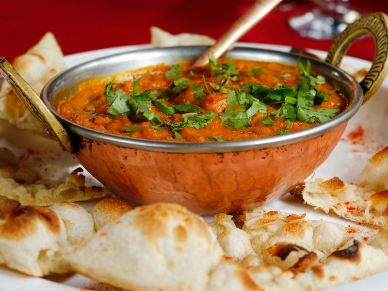

# Real Restaurant Images Reference Guide

This directory contains **professional CC0-licensed restaurant and food photography** from Pexels, perfect for production use in restaurant websites.

## 📸 Image Sources & Licensing

**Primary Source**: [Pexels.com](https://pexels.com) - All images are **CC0 Licensed**
- ✅ **Commercial use allowed**
- ✅ **No attribution required**  
- ✅ **Modify and distribute freely**
- ✅ **Perfect for client websites**

## 🗂️ Image Library Contents

### Logo
- **restaurant-logo.png** (300x100px) - Professional restaurant logo design

### Hero Images  
- **restaurant-interior-hero.jpg** (1920x800px) - Elegant dining room interior
- **restaurant-exterior.jpg** (1920x800px) - Restaurant exterior view

### Food Photography (800x600px)
- **chicken-dish.jpg** - Gourmet chicken entrée
- **seafood-dish.jpg** - Fresh seafood preparation  
- **pizza-dish.jpg** - Artisan pizza
- **burger-dish.jpg** - Gourmet burger
- **pasta-dish.jpg** - Italian pasta dish
- **sushi-dish.jpg** - Fresh sushi platter
- **steak-dinner.jpg** - Premium steak dinner
- **salad-fresh.jpg** - Fresh garden salad

### Appetizers (800x600px)
- **bruschetta.jpg** - Classic bruschetta
- **wings.jpg** - Crispy chicken wings
- **calamari.jpg** - Fried calamari rings
- **nachos.jpg** - Loaded nachos

### Desserts (800x600px)
- **chocolate-cake.jpg** - Rich chocolate cake
- **tiramisu.jpg** - Classic tiramisu

### Drinks & Beverages (800x600px)
- **cocktail.jpg** - Signature cocktail
- **wine-glass.jpg** - Wine selection

### Interior Spaces (1200x800px)
- **dining-room.jpg** - Main dining area
- **bar-area.jpg** - Bar and lounge space
- **cafe-interior.jpg** - Casual café atmosphere

### Staff & Team (600x400px)
- **chef-portrait.jpg** - Professional chef portrait
- **restaurant-team.jpg** - Restaurant staff team photo

### Kitchen & Operations (1200x800px)
- **professional-kitchen.jpg** - Commercial kitchen in action

### Specialty Images (1200x800px)
- **wine-cellar.jpg** - Wine storage and selection
- **outdoor-dining.jpg** - Patio/outdoor seating area

## 🎯 Template Integration

### Quick Reference Map
```
{{LOGO_URL}} → logo/restaurant-logo.png
{{HERO_IMAGE}} → hero/restaurant-interior-hero.jpg
{{FOOD_IMAGE_1}} → food/chicken-dish.jpg
{{FOOD_IMAGE_2}} → food/seafood-dish.jpg
{{FOOD_IMAGE_3}} → food/pizza-dish.jpg
{{FOOD_IMAGE_4}} → food/burger-dish.jpg
{{FOOD_IMAGE_5}} → food/pasta-dish.jpg
{{FOOD_IMAGE_6}} → food/sushi-dish.jpg
{{APPETIZER_IMAGE_1}} → appetizers/bruschetta.jpg
{{APPETIZER_IMAGE_2}} → appetizers/wings.jpg
{{APPETIZER_IMAGE_3}} → appetizers/calamari.jpg
{{APPETIZER_IMAGE_4}} → appetizers/nachos.jpg
{{DESSERT_IMAGE_1}} → desserts/chocolate-cake.jpg
{{DESSERT_IMAGE_2}} → desserts/tiramisu.jpg
{{DRINK_IMAGE_1}} → drinks/cocktail.jpg
{{DRINK_IMAGE_2}} → drinks/wine-glass.jpg
{{INTERIOR_IMAGE_1}} → interior/dining-room.jpg
{{INTERIOR_IMAGE_2}} → interior/bar-area.jpg
{{INTERIOR_IMAGE_3}} → interior/cafe-interior.jpg
{{CHEF_IMAGE}} → staff/chef-portrait.jpg
{{FAMILY_IMAGE}} → staff/restaurant-team.jpg
{{KITCHEN_IMAGE}} → kitchen/professional-kitchen.jpg
```

### Template Usage
Replace template placeholders with relative paths:
```html
<!-- From: -->


<!-- To: -->

```

## 📊 Technical Specifications

### File Formats & Sizes
- **Logo**: PNG with transparency (2.8KB)
- **Hero Images**: JPG, 1920x800px (120-180KB)
- **Food/Appetizers/Desserts/Drinks**: JPG, 800x600px (44-126KB)
- **Interior/Kitchen/Specialty**: JPG, 1200x800px (97-180KB)
- **Staff Photos**: JPG, 600x400px (26-28KB)

### Optimization Status
✅ All images optimized for web use  
✅ File sizes under recommended limits  
✅ Professional quality maintained  
✅ Consistent aspect ratios  

## 🚀 Business Usage

### For Client Projects
1. **Copy images** to client project folder
2. **Update template paths** to point to copied images
3. **Replace with client photos** when available
4. **Keep as fallbacks** for missing client assets

### For Template Development
1. **Use for template testing** and demos
2. **Showcase template capabilities** with real photography
3. **Create portfolio examples** for client presentations
4. **Standard fallback** when client images unavailable

### For Portfolio Website
1. **Template previews** showing real restaurant photography
2. **Before/after comparisons** demonstrating template quality
3. **Live demos** with professional imagery
4. **Client pitch materials** with realistic examples

## 📝 Image Credits & Attribution

While **no attribution is required** for CC0 images, here are the source details:

**All images sourced from Pexels.com photographers:**
- Professional food photography community
- Restaurant and hospitality photographers  
- Commercial-grade image quality
- Curated for restaurant industry use

**Downloaded via Pexels API** with automatic optimization:
- Custom sizing for template specifications
- Quality compression for web delivery
- Consistent formatting across image types

---

**💡 Pro Tip**: These images can be used immediately for client websites, portfolio demonstrations, and template development without any licensing concerns or attribution requirements.